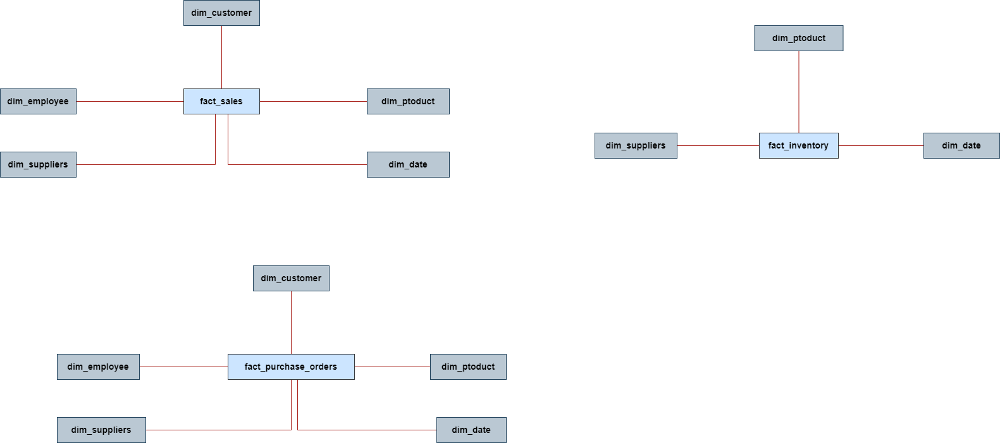
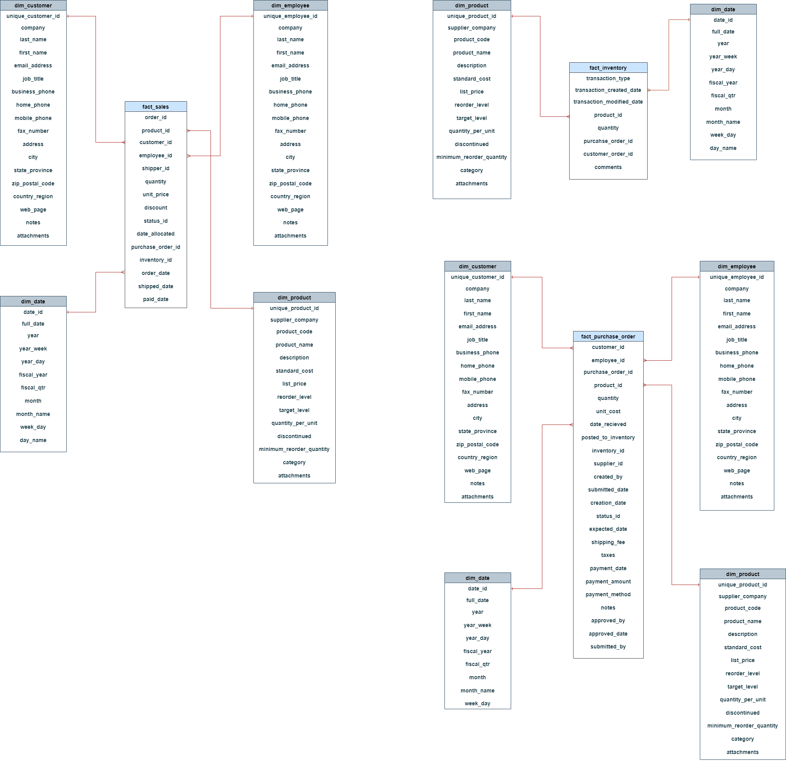
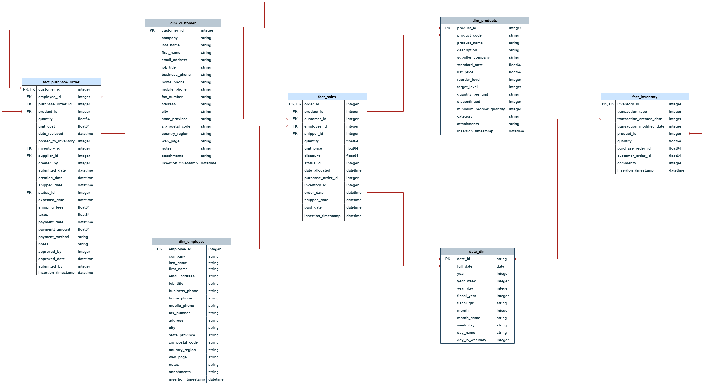
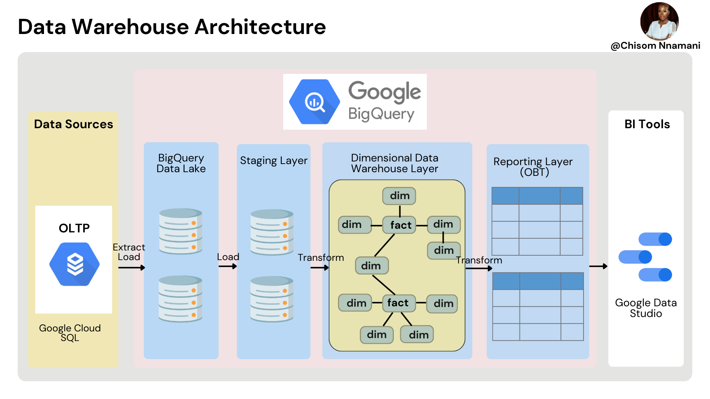
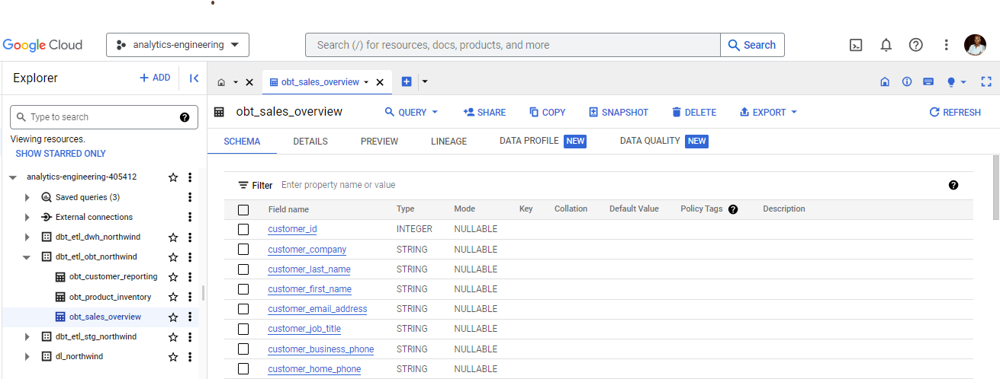

# Building Dimensional Model using BigQuery and dbt
This project is about building a dimensional data warehouse in BigQuery by transforming an OLTP system to an OLAP system, using dbt as our data transformation tool.

The OLTP system contains the sales data of Northwind; a specialty food export-import company.

## Aim
To bring Northwind's data reporting up to speed by embracing Dimensional Modeling.

## Introducing OLAP for Northwind OLTP Database
<b>What's the current setup or architecture?</b>

- Northwind traders are companies that buy and sell special foods worldwide.
- This is a practice database made by Microsoft to showcase its product features and for learning purposes.
- The current setup combines on-site and older systems.
- They use MySQL for their main daily sales transactions.
- MySQL is also used for creating and running reports, but it's not efficient because analytical queries slow down the transaction system.
 

<b>Why do we need a new setup or architecture?</b>

- To scale up more easily.
- To make reports faster.
- To ease the burden on day-to-day operations.
- To enhance data security with better access control.

<b>How do we set up a new system or architecture?</b>

- Northwind traders can shift their current database to GCP.
- The on-site MySQL can be swapped with a fully managed cloud SQL.
- To handle reports, we'll create an OLAP data warehouse on GCP using BigQuery.
- We'll construct a Dimensional Data Warehouse on BigQuery following Kimball's method, incorporating dim and fact tables.

## Identifying Business Requirements
Throughout the interview process with the business and stakeholders, the following business processses were identified:
- <b>Sales Overview:</b> 
Overall sales reports to understand better, what is being sold to our customers, what sells the most, where and what sells the least, the goal is to have a general overview of how the business is going.
- <b>Product Inventory: </b>
Understand the current inventory levels and how to improve stock management, what suppliers we have, and how much is being purchased. This will allow Northwind to understand stock management and potentially land better deals with suppliers
- <b>Customer Reporting: </b>
Allow customers to understand their purchase orders, how much and when they are buying, empowering them to make data-driven decisions while Northwind utilizes this data in combination with its sales data.

This means the business is looking forward to getting insights on sales overview, product inventory, and customer reporting.

### Identifying required tables from ERD

From the above ERD diagram of the OLTP transactional system, we identify the following required tables that will enable us to meet the business requirements:

 
<li>Customers - Customers who buy items from Northwind</li>
<li>Employees - Those who work for Northwind</li>
<li>Orders - Sales Order transactions taking place between the customers & Northwind</li>
<li>Order Details - Order Details for the Orders placed by customer</li>
<li>Inventory Transaction - Transaction details of each inventory</li>
<li>Products - Current Northwind products that customers can purchase</li>
<li>Shippers - Shipped orders from Northwind to customers</li>
<li>Suppliers - Supplies Northwind with required items</li>
<li>Invoices - Invoice created for each order</li>

### Proposed Data Modelling Concepts
- <b>Conceptual Data Model</b>

  

- <b>Logical Data Model</b>

  

- <b>Physical Data Model</b>

  

### Proposed Kimball Data Warehouse Architecture
Below is the proposed data warehouse architecture, which focuses on how the data flows from the old MySQL OLTP database to the new modernized dimensional data warehouse in BigQuery during the migration.

  

From the image below you can find the three layers (datasets) created in Bigquery through DBT. They are identified by the "dbt prefix"
 

The above three data layers help to achieve the business requirements of the Northwind and Sales Overview, Product Inventory, and Customer Reporting processes can now be carried out effectively to draw out insights.

### Results
- The new Data Warehouse uses Bigquery for analytics and Business Intelligence which is more efficient than the previous MySQL system.
- The Reporting is derived from One Big Table denormalised from Dimensional models
- Sales Overview, Product Inventory, and Customer Reporting processes can now be carried out effectively to draw out insights

### Getting started on dbt project
- Commands to install dbt and connect to bigquery <a href="https://github.com/priye-1/OLAP_Dimensional_Modeling_for_Advanced_Analytics/blob/master/sql_bash_commands/dbt_bash_setup.sh">here</a>
- Commands to create tables and insert data <a href="https://github.com/priye-1/OLAP_Dimensional_Modeling_for_Advanced_Analytics/tree/master/sql_bash_commands/bigquery_tables_setup">here</a>
- Commands to create Dim and Fact tables in different layers can be found <a href="https://github.com/priye-1/OLAP_Dimensional_Modeling_for_Advanced_Analytics/tree/master/models">here</a>
- If you are not able to enable billing for Bigquery on your account, insert data manually by uploading csv files located <a href="https://github.com/priye-1/OLAP_Dimensional_Modeling_for_Advanced_Analytics/tree/master/datasets">here</a>

### Resources:
- Learn more about dbt [in the docs](https://docs.getdbt.com/docs/introduction)
- Check out [Discourse](https://discourse.getdbt.com/) for commonly asked questions and answers
- Join the [chat](https://community.getdbt.com/) on Slack for live discussions and support
- Find [dbt events](https://events.getdbt.com) near you
- Check out [the blog](https://blog.getdbt.com/) for the latest news on dbt's development and best practices

***
Click on the [analytics_engineering](https://github.com/Chisomnwa/Building-OLAP-Dimensional-Model-using-BigQuery-and-DBT/tree/main/analytics_engineering) folder to see all the folders and files created during this project. 🌟💡

